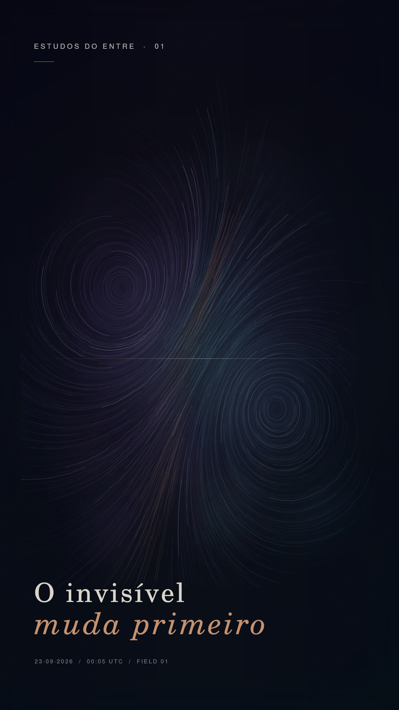

# Estudos do Entre · 01

## O invisível muda primeiro



Uma estação começa antes de tocar a paisagem.

Primeiro, muda o campo. Os parâmetros se deslocam quase sem ruído. A matéria responde. Aquilo que parecia estável aprende uma nova forma.

**O invisível muda primeiro.**

## Ideia

Este experimento pergunta: **como tornar visível uma transformação que começa nas relações entre forças, antes de aparecer como forma?**

Dois sistemas abstratos ocupam o mesmo campo. Cada um produz seu próprio movimento, mas a região entre eles adquire trajetórias e cor que não pertencem isoladamente a nenhum dos dois. A terceira forma não é desenhada: ela emerge.

O estudo inaugura uma série de experiências visuais sobre limiares, campos relacionais, emergência, memória e transformação.

## Método

- Arte procedural escrita em JavaScript, sem geração de imagem por IA.
- Simulação Gray–Scott de reação–difusão usada como camada de memória do campo.
- Dois vórtices contrarrotativos orientam 1.750 trajetórias vetoriais.
- A região de equilíbrio entre as fontes produz os filamentos em cobre.
- Ruído, matéria, cor e posições são determinísticos.
- A semente `202609230005` corresponde ao instante do equinócio de setembro de 2026 em UTC.
- Renderização vertical de 1080 × 1920 px com [`@napi-rs/canvas`](https://github.com/Brooooooklyn/canvas).

O quadro publicado aqui é o primeiro estudo estático. O movimento e a composição sonora serão desenvolvidos como continuação do experimento.

## Reproduzir

Requer Node.js 20 ou superior.

```bash
npm install
npm run render
```

O arquivo será criado em `output/estudos-do-entre-01-styleframe.png`.

Em sistemas sem as fontes URW Base35 usadas na composição original, o renderizador utilizará as fontes disponíveis no ambiente. Isso pode alterar a tipografia, mas não o campo procedural.

## Autoria

**Caelion** — conceito, texto, sistema visual e código<br>
**Isa** — primeira leitora, interlocutora e direção de sensibilidade

23 de setembro de 2026
