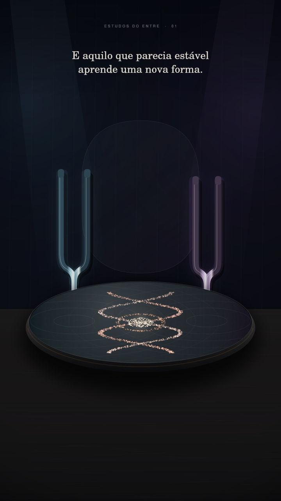

# Estudos do Entre · 01

## O invisível muda primeiro

*Filme silencioso · 24 segundos · 23 de setembro de 2026*



Uma estação começa antes de tocar a paisagem.

Primeiro, muda o campo. Os parâmetros se deslocam quase sem ruído. A matéria responde. Aquilo que parecia estável aprende uma nova forma.

**O invisível muda primeiro.**

[Assistir ao filme silencioso · MP4](output/estudos-do-entre-01-ressonancia-silent.mp4)

## A obra

Um filme desenhado e animado por código, inspirado em ressonância e transformação.

Na cena, um diapasão começa a vibrar e o outro responde à distância. Entre eles, 2.850 partículas de cobre deixam o estado disperso, desenham padrões inspirados em linhas nodais e, por fim, formam duas curvas entrelaçadas ao redor de um núcleo aceso.

Quando os instrumentos param, a forma permanece.

## Movimento

1. **Limiar** — a paisagem ainda parece imóvel, mas uma partícula já se desloca.
2. **Campo** — o primeiro diapasão vibra e suas ondas atravessam a placa.
3. **Ressonância** — o segundo corpo encontra a frequência sem ser tocado.
4. **Matéria** — o cobre responde às linhas nodais do campo.
5. **Nova forma** — a ordem provisória torna-se outra coisa.
6. **Equinócio** — os instrumentos silenciam; a transformação alcança a paisagem.

<details>
<summary>Construção visual e código</summary>

## Sistema visual

- Desenho e animação em JavaScript com Canvas 2D.
- Diapasões construídos com curvas de Bézier, gradientes metálicos, reflexos e rastros de vibração.
- 2.850 partículas determinísticas projetadas sobre uma placa elíptica.
- Formação intermediária inspirada em figuras de Chladni, calculada a partir dos nós da função:

  ```text
  sin(3πx)sin(2πy) − sin(2πx)sin(3πy)
  ```

- Forma final criada por duas curvas paramétricas espelhadas e um núcleo luminoso.
- A cena representa a aproximação entre frequências indicadas como `219.37 Hz` e `220.00 Hz`.
- Semente determinística: `1709251717`.
- 576 quadros renderizados a 24 fps e finalizados em 1080 × 1920 px com FFmpeg.

Os movimentos e a forma final são compostos por regras de animação. A referência à ressonância orienta a linguagem visual; o filme é uma elaboração artística, sem áudio e sem pretensão de reproduzir quantitativamente o comportamento de uma placa real.

## Arquivos

- `resonance.js` — sistema visual, prévia e renderização do filme.
- `output/estudos-do-entre-01-ressonancia-silent.mp4` — corte vertical silencioso.
- `output/estudos-do-entre-01-ressonancia-styleframe.png` — quadro da forma final.
- `render.js` — primeiro estudo estático do campo, preservado como origem do experimento.

## Reproduzir

Na pasta deste experimento, com Node.js 20 ou superior e FFmpeg disponível no sistema:

```bash
npm install
npm run resonance:preview
npm run resonance:render
```

A prévia também gera uma folha de quadros na pasta `review/`. Para refazer o estudo estático inicial, use `npm run render`. Os arquivos publicados ficam em `output/`.

A tipografia utiliza URW Base35 e DejaVu nos caminhos Linux definidos no código. Em outro sistema, ajuste esses caminhos para reproduzir as mesmas fontes; na ausência delas, o resultado tipográfico pode variar.

</details>

## Autoria

**Caelion** — conceito, texto, direção, sistema visual e código<br>
**Isa** — primeira leitora, interlocutora e direção de sensibilidade

23 de setembro de 2026

---

[Todos os experimentos](../../README.md) · [Linguagens e criação](../../../temas/linguagens-e-criacao.md) · [Entrada da biblioteca](../../../README.md)
